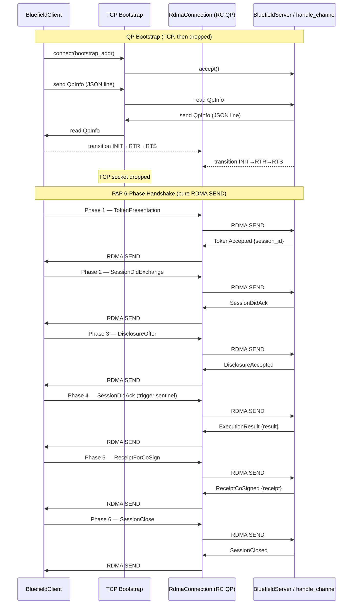

# pap-bluefield — RDMA Handshake Sequence

Full PAP 6-phase handshake over an RDMA RC queue pair with TCP bootstrap.
Source: Greptile code review, PR #324.

```mermaid
sequenceDiagram
    participant C as BluefieldClient
    participant T as TCP Bootstrap
    participant R as RdmaConnection (RC QP)
    participant S as BluefieldServer / handle_channel

    Note over C,S: QP Bootstrap (TCP, then dropped)
    C->>T: connect(bootstrap_addr)
    T->>S: accept()
    C->>T: send QpInfo (JSON line)
    T->>S: read QpInfo
    S->>T: send QpInfo (JSON line)
    T->>C: read QpInfo
    C-->>R: transition INIT→RTR→RTS
    S-->>R: transition INIT→RTR→RTS
    Note over T: TCP socket dropped

    Note over C,S: PAP 6-Phase Handshake (pure RDMA SEND)
    C->>R: Phase 1 — TokenPresentation
    R->>S: RDMA SEND
    S->>R: TokenAccepted {session_id}
    R->>C: RDMA SEND

    C->>R: Phase 2 — SessionDidExchange
    R->>S: RDMA SEND
    S->>R: SessionDidAck
    R->>C: RDMA SEND

    C->>R: Phase 3 — DisclosureOffer
    R->>S: RDMA SEND
    S->>R: DisclosureAccepted
    R->>C: RDMA SEND

    C->>R: Phase 4 — SessionDidAck (trigger sentinel)
    R->>S: RDMA SEND
    S->>R: ExecutionResult {result}
    R->>C: RDMA SEND

    C->>R: Phase 5 — ReceiptForCoSign
    R->>S: RDMA SEND
    S->>R: ReceiptCoSigned {receipt}
    R->>C: RDMA SEND

    C->>R: Phase 6 — SessionClose
    R->>S: RDMA SEND
    S->>R: SessionClosed
    R->>C: RDMA SEND
```
